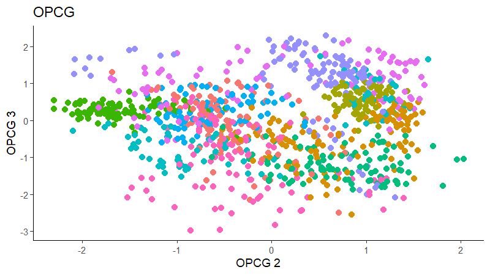

```{r, include = FALSE}
knitr::opts_chunk$set(
  collapse = TRUE,
  comment = "#>"
)
```

In this vignette, we demonstrate the available methods for linear Sufficient Dimension Reduction methods when working with categorical responses. 


```{r setup}
library(linearsdr)
library(ggplot2)
library("doParallel")
library("foreach")
# check number of cores available
# print( paste( as.character(detectCores()), "cores detected" ) );

# Create cluster with desired number of cores
cl <- makePSOCKcluster(detectCores()-1)

# Register cluster
doParallel::registerDoParallel(cl)

# Find out how many cores are being used
# print( paste( as.character(getDoParWorkers() ), "cores registered" ) )

```


## Categorical Responses

We demonstrate methods for categorical data on the handwritten pen digits dataset available [here](https://archive.ics.uci.edu/ml/datasets/Pen-Based+Recognition+of+Handwritten+Digits), which consists of 16 predictors representing written features and one categorical response for the digits 0-9. We randomly sample 1000 observations from the training set and 1000 observations from the testing set. These two samples are combined into the 'pendigits_datta' matrix, with the first 1000 being the training and last 1000 being the testing. 


```{r}
data('pendigits_datta', package="linearsdr")

X1 = as.matrix(pendigits_datta[1:1000,1:16])
Y1 = c(pendigits_datta[1:1000,17])

X1_test = as.matrix(pendigits_datta[1001:2000,1:16])
Y1_test = c(pendigits_datta[1001:2000,17])

```

For Inverse methods, since the response is categorical, the number of slices are taken to be equal to the number of levels in the response. That is, we take 10 slices for SIR, SAVE and DR. 
For all methods, we plot the first three predictors against each other, coloring in the labels to illustrate the separation of digits.


### Sliced Inverse Regression (SIR)

For SIR, we can only recover 9 directions since we are using 10 slices, so we set $d=9$. 
```{r, fig.show="hold"}
# Sliced Inverse Regression

b_hat_sir1 = sir(x=X1, y=Y1, nslices = 10, d=9, ytype = "categorical" )$beta


linearsdr:::ggplot_fsdr(Y1_test, t((X1_test)%*%b_hat_sir1[,c(1,2)]), y_on_axis=F,
                        ytype="multinomial",
                        h_lab='SIR 1', v_lab='SIR2',
                        main_lab= paste0('SIR'), size=2.5)

linearsdr:::ggplot_fsdr(Y1_test, t((X1_test)%*%b_hat_sir1[,c(2,3)]), y_on_axis=F,
                        ytype="multinomial",
                        h_lab='SIR 2', v_lab='SIR3',
                        main_lab= paste0('SIR'), size=2.5)

linearsdr:::ggplot_fsdr(Y1_test, t((X1_test)%*%b_hat_sir1[,c(1,3)]), y_on_axis=F,
                        ytype="multinomial",
                        h_lab='SIR 1', v_lab='SIR3',
                        main_lab= paste0('SIR'), size=2.5)

```


### Sliced Average Variance Estimator (SAVE)

For SAVE, we do not have the same constraint on $d$, but we set it to $9$ out of convenience. It has no effect on the estimation.

```{r, fig.show="hold"}
# Sliced Average Variance Estimator

b_hat_save1 = save_sdr(x=X1, y=Y1, nslices = 10, d=9, ytype = "categorical" )$beta


linearsdr:::ggplot_fsdr(Y1_test, t((X1_test)%*%b_hat_save1[,c(1,2)]), y_on_axis=F,
                        ytype="multinomial",
                        h_lab='SAVE 1', v_lab='SAVE 2',
                        main_lab= paste0('SAVE'), size=2.5)

linearsdr:::ggplot_fsdr(Y1_test, t((X1_test)%*%b_hat_save1[,c(2,3)]), y_on_axis=F,
                        ytype="multinomial",
                        h_lab='SAVE 2', v_lab='SAVE 3',
                        main_lab= paste0('SAVE'), size=2.5)

linearsdr:::ggplot_fsdr(Y1_test, t((X1_test)%*%b_hat_save1[,c(1,3)]), y_on_axis=F,
                        ytype="multinomial",
                        h_lab='SAVE 1', v_lab='SAVE3',
                        main_lab= paste0('SAVE'), size=2.5)


```

### Directional Regression (DR)

Similarly for DR, we do not have the same constraint on $d$, but we set it to $9$ out of convenience. It has no effect on the estimation.


```{r, fig.show="hold"}
# Directional Regression

b_hat_dr1 = dr(x=X1, y=Y1, nslices = 10, d=9, ytype = "categorical" )$beta


linearsdr:::ggplot_fsdr(Y1_test, t((X1_test)%*%b_hat_dr1[,c(1,2)]), y_on_axis=F,
                        ytype="multinomial",
                        h_lab='DR 1', v_lab='DR 2',
                        main_lab= paste0('DR'), size=2.5)

linearsdr:::ggplot_fsdr(Y1_test, t((X1_test)%*%b_hat_dr1[,c(2,3)]), y_on_axis=F,
                        ytype="multinomial",
                        h_lab='DR 2', v_lab='DR 3',
                        main_lab= paste0('DR'), size=2.5)

linearsdr:::ggplot_fsdr(Y1_test, t((X1_test)%*%b_hat_dr1[,c(1,3)]), y_on_axis=F,
                        ytype="multinomial",
                        h_lab='DR 1', v_lab='DR 3',
                        main_lab= paste0('DR'), size=2.5)


```

### Outer Product of Canonical Gradients (OPCG)

For OPCG, we use a Gaussian kernel for the local linear weights and standardize the predictors so that the kernel choice is more appropriate. The bandwidth is set to $1.42$ using the Tuning method for OPCG proposed in the paper. We parallelize the computation to make OPCG relatively competitive with the inverse methods in terms of computation. For convenience, we set $d=9$; this has no effect on the estimation. The code is not run due to the compiling speed for this site.  




```{r, fig.show="hold"}
# OPG Estimate 

 
# X1_std=(sapply(1:dim(X1)[2], FUN= function(j)
#   center_cpp(X1[,j], NULL) ) )%*%matpower_cpp(cov((X1)) , -1/2);
# 
# 
# b_hat_opcg1 = opcg(x=X1_std, y=Y1, bw = 1.42, d=9, ytype = "cat", 
#                   method= "cg", parallelize = T )
# 
# 
# opcg_plot1_1=linearsdr:::ggplot_fsdr(Y1_test, t((X1_test)%*%b_hat_opcg1[,c(1,2)]),
#                                      y_on_axis=F,
#                                      ytype="multinomial",
#                                      h_lab='OPCG 1', v_lab='OPCG 2',
#                                      main_lab= paste0('OPCG'), size=2.5)
# 
# opcg_plot1_2=linearsdr:::ggplot_fsdr(Y1_test, t((X1_test)%*%b_hat_opcg1[,c(2,3)]),
#                                      y_on_axis=F,
#                                       ytype="multinomial",
#                                       h_lab='OPCG 2', v_lab='OPCG 3',
#                                       main_lab= paste0('OPCG'), size=2.5)
# 
# opcg_plot1_3=linearsdr:::ggplot_fsdr(Y1_test, t((X1_test)%*%b_hat_opcg1[,c(1,3)]),
#                                      y_on_axis=F,
#                                       ytype="multinomial",
#                                       h_lab='OPCG 1', v_lab='OPCG 3',
#                                       main_lab= paste0('OPCG'), size=2.5)
# 
# linearsdr:::save_sdr_plot(opcg_plot1_3,
#                           filename = paste0('../man/figures/cat/ex1_opcg3.png'),
#                           width = 800, height = 450, units = "px", pointsize = 12,
#                           bg = "white",  res = 150)


```


### Minimum Average Variance Estimation (MAVE)

We use a Gaussian kernel for the local linear weights and standardize the predictors so that the kernel choice is more appropriate. For the starting value of the $\beta$ matrix, We use a $p \times d$ matrix with the upper $d \times d$ block being the identity. 
The bandwidth is set to $1.42$ and we set $d=9$ since this is the estimated dimension according to the Predictor Augmentation method. 


```{r,  fig.show="hold"}
# MAVE Estimate

# The code is commented out to speed up compiling of the documentation. 

# n=length(Y1)
# 
# start_time1 = Sys.time();
# B_hat_made1= made(X1, Y1, d=9, bw=1.42, lambda=0, B_mat=NULL, 
#                   ytype="cat",
#                   method=list(opcg="cg", made="cg"), parallelize=T, r_mat=NULL,
#                   control_list = list(print_iter=T, max_iter_made=10, max_iter=10));
# 
# 
# end_time1 = Sys.time(); end_time1 - start_time1;
# 
# # [1] "2021-11-16 00:14:12 EST"
# # [1] "MADE: euc_dist dist is" "0.343483075608127"      "1"
# # [1] "MADE: euc_dist dist is" "0.26444545390969"       "2"
# # [1] "MADE: euc_dist dist is" "0.216705259641036"      "3"
# # [1] "MADE: euc_dist dist is" "0.18994894599904"       "4"
# # [1] "MADE: euc_dist dist is" "0.153602241573158"      "5"
# # [1] "MADE: euc_dist dist is" "0.126204506547097"      "6"
# # [1] "MADE: euc_dist dist is" "0.117781922425232"      "7"
# # [1] "MADE: euc_dist dist is" "0.102576841906797"      "8"
# # [1] "MADE: euc_dist dist is" "0.0897011392715833"     "9"
# # [1] "MADE: euc_dist dist is" "0.0813778799489298"     "10"
# # [1] "0 - non-convergence"
# # Time difference of 1.159333 hours on 39 cores
# 
# 
#  
# 
# 
# made_plot1_1=linearsdr:::ggplot_fsdr(Y1_test, t((X1_test)%*%b_hat_made1[,c(1,2)]),
#                                      y_on_axis=F,
#                                      ytype="multinomial",
#                                      h_lab='MADE 1', v_lab='MADE 2',
#                                      main_lab= paste0('MADE'), size=2.5)
# 
# made_plot1_2=linearsdr:::ggplot_fsdr(Y1_test, t((X1_test)%*%b_hat_made1[,c(2,3)]),
#                                      y_on_axis=F,
#                                       ytype="multinomial",
#                                       h_lab='MADE 2', v_lab='MADE 3',
#                                       main_lab= paste0('MADE'), size=2.5)
# 
# made_plot1_3=linearsdr:::ggplot_fsdr(Y1_test, t((X1_test)%*%b_hat_made1[,c(1,3)]),
#                                      y_on_axis=F,
#                                       ytype="multinomial",
#                                       h_lab='MADE 1', v_lab='MADE 3',
#                                       main_lab= paste0('MADE'), size=2.5)
# 
# linearsdr:::save_sdr_plot(made_plot1_1,
#                           filename = paste0('../man/figures/cat/ex1_made1.png'),
#                           width = 800, height = 450, units = "px", pointsize = 12,
#                           bg = "white",  res = 150)
```

