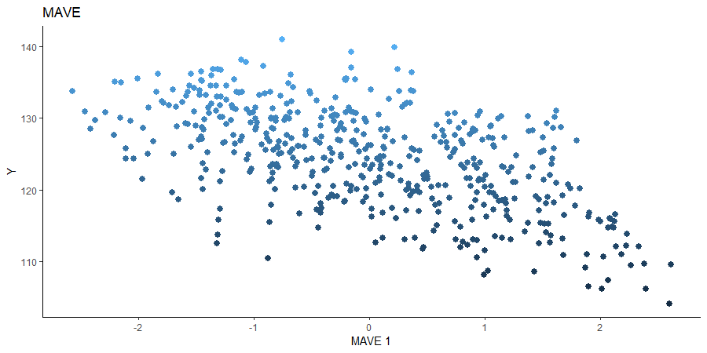

```{r, include = FALSE}
knitr::opts_chunk$set(
  collapse = TRUE,
  comment = "#>"
)
```

In this vignette, we demonstrate the available methods for linear Sufficient Dimension Reduction methods when working with continuous responses. The datasets are all accessible from the UCI repository [here](https://archive.ics.uci.edu/ml/index.php).


```{r setup}
library(linearsdr)
library(ggplot2)
library("doParallel")
library("foreach")
# check number of cores available
# print( paste( as.character(detectCores()), "cores detected" ) );

# Create cluster with desired number of cores
cl <- makePSOCKcluster(detectCores()-1)

# Register cluster
doParallel::registerDoParallel(cl)

# Find out how many cores are being used
# print( paste( as.character(getDoParWorkers() ), "cores registered" ) )

```


## A First Example

For a first example, we apply the available methods for continuous responses on the airfoil self-noise dataset. This dataset is available [here](https://archive.ics.uci.edu/ml/datasets/airfoil+self-noise) and consists of 5 predictors and one response. The variables are measurements taken during airfoil tests and the response is the sound pressure level. Two of the predictors are discrete, which violate some theoretical assumptions for the methods applied, but we will see that the methods can still work well. A pairs plot illustrates the discreteness for some of the predictors. We randomly sample a subset of $500$ for our estimation since the computation for MAVE can get quite slow.


```{r}
data('airfoil_datta', package="linearsdr")
# summary(airfoil_datta)

X1 = as.matrix(airfoil_datta[,1:5])
Y1 = c(airfoil_datta[,6])

pairs(X1)

```

### Sliced Inverse Regression (SIR)

We choose the number of slices to be $5$ and plot only the first sufficient predictor against the response.

```{r}
# Sliced Inverse Regression

b_hat_sir1 = sir(x=X1, y=Y1, nslices = 5, d=2, ytype = "continuous" )$beta


linearsdr:::ggplot_fsdr(Y1, t((X1)%*%b_hat_sir1[,1]), y_on_axis=T,
                        ytype="continuous",
                        h_lab='SIR 1', v_lab='Y',
                        main_lab= paste0('SIR'), size=2.5)

```


### Sliced Average Variance Estimator (SAVE)

We choose the number of slices to be $5$ and plot only the first sufficient predictor against the response.

```{r}
# Sliced Average Variance Estimator

b_hat_save1 = save_sdr(x=X1, y=Y1, nslices = 5, d=2, ytype = "continuous" )$beta


linearsdr:::ggplot_fsdr(Y1, t((X1)%*%b_hat_save1[,1]), y_on_axis=T, 
                        ytype="continuous",
                        h_lab='DR 1', v_lab='Y',
                        main_lab= paste0('DR'), size=2.5)


```

### Directional Regression (DR)

We choose the number of slices to be $5$ and plot only the first sufficient predictor against the response.

```{r}
# Directional Regression

b_hat_dr1 = dr(x=X1, y=Y1, nslices = 5, d=2, ytype = "continuous" )$beta


linearsdr:::ggplot_fsdr(Y1, t((X1)%*%b_hat_dr1[,1]), y_on_axis=T, 
                        ytype="continuous",
                        h_lab='DR 1', v_lab='Y',
                        main_lab= paste0('DR'), size=2.5)


```

### Outer Product of Gradients (OPG)

We use a Gaussian kernel for the local linear weights and standardize the predictors so that the kernel choice is more appropriate. The bandwidth is set to $5$ and we plot only the first sufficient predictor against the response. We parallelize the computation out of convenience here. 

```{r}
# OPG Estimate 


X1_std=(sapply(1:dim(X1)[2], FUN= function(j)
  center_cpp(X1[,j], NULL) ) )%*%matpower_cpp(cov((X1)) , -1/2);


b_hat_opg1 = opcg(x=X1_std, y=Y1, bw = 5, d=2, ytype = "continuous", 
                 method= "cg", parallelize = T )


linearsdr:::ggplot_fsdr(Y1, t((X1_std)%*%b_hat_opg1[,1]), y_on_axis=T,
                        ytype="continuous",
                        h_lab='OPG 1', v_lab='Y',
                        main_lab= paste0('OPG'), size=2.5)

```


### Minimum Average Variance Estimation (MAVE)

We use a Gaussian kernel for the local linear weights and standardize the predictors so that the kernel choice is more appropriate. For the starting value of the $\beta$ matrix, We use a $p \times d$ matrix with the upper $d \times d$ block being the identity. The bandwidth is set to $5$ and we plot only the first sufficient predictor against the response.


```{r}
# MAVE Estimate

# The code is commented out to speed up compiling of the documentation. 

# n=length(Y1)
# 
# start_time1 = Sys.time();
# b_hat_made1 = made(x=(X1_std), matrix(Y1, nrow = n, ncol=1), bw=5, d=2,
#                   ytype='continuous',
#                   method=list(opcg="cg", made="cg"), B_mat = NULL,
#                   parallelize=T,
#                   control_list=list(print_iter=T, max_iter_made=5) )
# 
# end_time1 = Sys.time(); end_time1 - start_time1;
#
# # [1] "MADE: euc_dist dist is" "0.331801141953547"      "1"
# # [1] "MADE: euc_dist dist is" "0.0112107472862494"     "2"
# # [1] "MADE: euc_dist dist is" "0.0102038542211796"     "3"
# # [1] "MADE: euc_dist dist is" "0.00497290505768543"    "4"
# # [1] "MADE: euc_dist dist is" "0.00261423206170839"    "5"
# # [1] "0 - non-convergence"
# # Time difference of 22.35525 mins
#  
# 
# mave_plot1=linearsdr:::ggplot_fsdr(Y1, t((X1_std)%*%b_hat_made1[,1]), y_on_axis=T,
#                                   ytype="continuous",
#                                   h_lab='MAVE 1', v_lab='Y1',
#                                   main_lab= paste0('MAVE'), size=2.5)
# 
# linearsdr:::save_sdr_plot(mave_plot1,filename = paste0('../man/figures/ex1_mave.png'),
#                           width = 900, height = 450, units = "px", pointsize = 12,
#                           bg = "white",  res = 100)

```


## Regularized Inverse Methods

We consider a larger number of predictors by using the Community and Crime data available [here](https://archive.ics.uci.edu/ml/datasets/communities+and+crime).


```{r}
data('crime_datta', package="linearsdr")
# dim(crime_datta)

X2 = crime_datta[, 1:( dim(crime_datta)[2] - 1) ]
Y2 = crime_datta[, dim(crime_datta)[2]]

# p2 = dim(X2)[2]; n2=dim(X2)[1];
 

```
### Sliced Inverse Regression (SIR)

For SIR, we use 5 slices and plot the first two sufficient predictors with the colored points representing the value of the response $Y$.

```{r}
# Sliced Inverse Regression

b_hat_sir2 = sir(x=X2, y=Y2, nslices = 5, d=2, ytype = "continuous",
                lambda = 0)$beta


linearsdr:::ggplot_fsdr(Y2, t((X2)%*%b_hat_sir2[,1:2]), y_on_axis=F,
                        ytype="continuous",
                        h_lab='SIR 1', v_lab='SIR 2',
                        main_lab= paste0('SIR'), size=2.5)
```

### Sliced Average Variance Estimator (SAVE)

For SAVE, we use 5 slices and consider the first two sufficient predictors. We consider a regularized SAVE with a regularization parameter, $\lambda$ set to 1. Both the un-regularized and regularized versions of SAVE fail to estimate any directions for dimension reduction.

```{r, fig.show="hold"}
# Sliced Average Variance Estimator

b_hat_save2 = save_sdr(x=X2, y=Y2, nslices = 5, d=2, ytype = "continuous",
              lambda = 0)$beta

b_hat_save2_reg = save_sdr(x=X2, y=Y2, nslices = 5, d=2, ytype = "continuous",
                  lambda = 1)$beta

# par(mar=c(1, 0, 0, 1), mfrow=c(1,1))

linearsdr:::ggplot_fsdr(Y2, t((X2)%*%b_hat_save2[,1:2]), y_on_axis=F,
                        ytype="continuous",
                        h_lab='SAVE 1', v_lab='SAVE 2',
                        main_lab= paste0('SAVE'), size=2.5)

linearsdr:::ggplot_fsdr(Y2, t((X2)%*%b_hat_save2_reg[,1]), y_on_axis=T,
                        ytype="continuous",
                        h_lab='SAVE 1', v_lab='Y',
                        main_lab= paste0('Regularized SAVE'), size=2.5)


```

### Directional Regression (DR)

For Directional Regression, we use 5 slices and consider the first two sufficient predictors. We consider a regularized SAVE with a regularization parameter, $\lambda$ set to 1. The un-regularized DR fails to estimate any directions for dimension reduction, while the regularized DR is able to estimate one sufficient direction for dimension reduction. 

```{r,  fig.show="hold"}
# Directional Regression

b_hat_dr2 = dr(x=X2, y=Y2, nslices = 5, d=2, ytype = "continuous",
              lambda = 0)$beta


b_hat_dr2_reg = dr(x=X2, y=Y2, nslices = 5, d=2, ytype = "continuous",
                  lambda = 1)$beta


linearsdr:::ggplot_fsdr(Y2, t((X2)%*%b_hat_dr2[,1:2]), y_on_axis=F,
                        ytype="continuous",
                        h_lab='DR 1', v_lab='DR 2',
                        main_lab= paste0('DR'), size=1)

linearsdr:::ggplot_fsdr(Y2, t((X2)%*%b_hat_dr2_reg[,1]), y_on_axis=T,
                        ytype="continuous",
                        h_lab='DR 1', v_lab='Y',
                        main_lab= paste0('Regularized DR'), size=2.5)


```

### Outer Product of Gradients (OPG)

We use a Gaussian kernel for the local linear weights and standardize the predictors so that the kernel choice is more appropriate. The bandwidth is set to $4$ and we consider the first two sufficient predictors against the response. 


```{r}

X2_std=(sapply(1:dim(X2)[2], FUN= function(j)
  center_cpp(X2[,j], NULL) ) )%*%matpower_cpp(cov((X2)) , -1/2);

b_hat_opg2 = opcg(x=X2_std, y=Y2, bw = 4, d=2, ytype = "continuous", 
                 method= "cg", parallelize = T )


linearsdr:::ggplot_fsdr(Y2, t((X2_std)%*%b_hat_opg2[,1:2]), y_on_axis=F,
                        ytype="continuous",
                        h_lab='OPG 1', v_lab='OPG 2',
                        main_lab= paste0('OPG'), size=2.5)

```

### Minimum Average Variance Estimation (MAVE)
We use a Gaussian kernel for the local linear weights and standardize the predictors so that the kernel choice is more appropriate. For the starting value of the $\beta$ matrix, we use the OPG estimator since the default $p \times d$ matrix with upper block as the identity failed to converge. 
The bandwidth is set to $4$ and we consider the first two sufficient predictors against the response.


```{r}
# MAVE Estimate

# # The code is commented out to speed up compiling of the documentation. 
# 
# start_time1 = Sys.time();
# b_hat_made2 = made(x=(X2_std), Y2, bw=4, d=2,
#                   ytype='continuous',
#                   method=list(opcg="cg", made="cg"), B_mat = b_hat_opg2,
#                   parallelize=T,
#                   control_list=list(print_iter=T, max_iter_made=5) )
# 
# end_time1 = Sys.time(); end_time1 - start_time1;
### For B_mat = NULL
# [1] "MADE: euc_dist dist is" "1.63713329933597e-15"  
# [3] "1"                     
# > 
# > end_time1 = Sys.time(); end_time1 - start_time1;
# Time difference of 34.67113 mins
# 
### For B_mat = b_hat_opg2
# [1] "MADE: euc_dist dist is" "0.00134310136692448"   
# [3] "1"                     
# [1] "MADE: euc_dist dist is" "4.66580981942468e-15"  
# [3] "2"                     
# > 
# > end_time1 = Sys.time(); end_time1 - start_time1;
# Time difference of 58.74611 mins
# 
# mave_plot2=linearsdr:::ggplot_fsdr(Y2, t((X2_std)%*%b_hat_made2[,1:2]),
#                                    y_on_axis=F,
#                                    ytype="continuous",
#                                    h_lab='MAVE 1', v_lab='Y',
#                                    main_lab= paste0('MAVE'), size=2.5)
# 
# mave_plot2
# 
# linearsdr:::save_sdr_plot(mave_plot2,filename =
#                             paste0('../man/figures/ex2_mave.png'),
#                                     width = 900, height = 450, units = "px",
#                                     pointsize = 12,
#                                     bg = "white",  res = 100)

```


## Multivariate $Y$

Energy Efficiency 

```{r}
data('energy_datta', package="linearsdr")
# summary(energy_datta)
# dim(energy_datta)

X3 = as.matrix(energy_datta[,1:8])
Y3 = cbind(energy_datta$Y1,energy_datta$Y2) 
Y3_1 = as.numeric(energy_datta$Y1)
Y3_2 = as.numeric(energy_datta$Y2)

pairs(X3)
```

### Sliced Inverse Regression (SIR)
```{r, fig.show="hold"}

b_hat_sir3_1 = sir(x=X3, y=Y3_1, nslices = 5, d=2, 
                   ytype = "continuous" )$beta

b_hat_sir3_2 = sir(x=X3, y=Y3_2, nslices = 5, d=2, 
                   ytype = "continuous" )$beta


linearsdr:::ggplot_fsdr(Y3_1, t((X3)%*%b_hat_sir3_1[,1]), y_on_axis=T,
                        ytype="continuous",
                        h_lab='SIR 1', v_lab='Y1',
                        main_lab= paste0('SIR'), size=3)

linearsdr:::ggplot_fsdr(Y3_2, t((X3)%*%b_hat_sir3_2[,1]), y_on_axis=T,
                        ytype="continuous",
                        h_lab='SIR 1', v_lab='Y2',
                        main_lab= paste0('SIR'), size=3)

linearsdr:::ggplot_fsdr(Y3_1, 
                        t((X3)%*%cbind(b_hat_sir3_1[,1], b_hat_sir3_2[,1])),
                        y_on_axis=T, 
                        ytype="continuous",
                        h_lab='SIR 1', v_lab='SIR 2',
                        main_lab= paste0('SIR'), size=2.5)


```


### Sliced Average Variance Estimator (SAVE)

We choose the number of slices to be $5$ and plot only the first sufficient predictor against the response.

```{r, fig.show="hold"}
# Sliced Average Variance Estimator

b_hat_save3_1 = save_sdr(x=X3, y=Y3_1, nslices = 5, d=2, ytype = "continuous" )$beta

b_hat_save3_2 = save_sdr(x=X3, y=Y3_2, nslices = 5, d=2, ytype = "continuous" )$beta


linearsdr:::ggplot_fsdr(Y3_1, t((X3)%*%b_hat_save3_1[,1]), y_on_axis=T, 
                        ytype="continuous",
                        h_lab='SAVE 1', v_lab='Y1',
                        main_lab= paste0('SAVE'), size=2.5)

linearsdr:::ggplot_fsdr(Y3_2, t((X3)%*%b_hat_save3_2[,1]), y_on_axis=T, 
                        ytype="continuous",
                        h_lab='SAVE 1', v_lab='Y2',
                        main_lab= paste0('SAVE'), size=2.5)


linearsdr:::ggplot_fsdr(Y3_1, 
                        t((X3)%*%cbind(b_hat_save3_1[,1], b_hat_save3_2[,1])),
                        y_on_axis=T, 
                        ytype="continuous",
                        h_lab='SAVE 1', v_lab='SAVE 2',
                        main_lab= paste0('SAVE'), size=2.5)


```

### Directional Regression (DR)
```{r, fig.show="hold"}

b_hat_dr3_1 = dr(x=X3, y=Y3_1, nslices = 5, d=2, ytype = "continuous" )$beta

b_hat_dr3_2 = dr(x=X3, y=Y3_2, nslices = 5, d=2, ytype = "continuous" )$beta


linearsdr:::ggplot_fsdr(Y3_1, t((X3)%*%b_hat_dr3_1[,1]), y_on_axis=T,
                        ytype="continuous",
                        h_lab='DR 1', v_lab='Y1',
                        main_lab= paste0('DR'), size=3)

linearsdr:::ggplot_fsdr(Y3_2, t((X3)%*%b_hat_dr3_2[,1]), y_on_axis=T,
                        ytype="continuous",
                        h_lab='DR 1', v_lab='Y2',
                        main_lab= paste0('DR'), size=3)


linearsdr:::ggplot_fsdr(Y3_1, 
                        t((X3)%*%cbind(b_hat_dr3_1[,1], b_hat_dr3_2[,1]) ),
                        y_on_axis=F,
                        ytype="continuous",
                        h_lab='DR 1', v_lab='DR 2',
                        main_lab= paste0('DR'), size=3)


```

### Outer Product of Gradients (OPG)
```{r, fig.show="hold"}
# Parallelization not run because of computational time. 

X3_std=(sapply(1:dim(X3)[2], FUN= function(j)
  center_cpp(X3[,j], NULL) ) )%*%matpower_cpp(cov((X3)) , -1/2);

b_hat_opg3 = opcg(x=X3_std, y=Y3, bw = .75, d=2, ytype = "continuous", 
                 method= "cg", parallelize = T )

linearsdr:::ggplot_fsdr(Y3_1, t((X3_std)%*%b_hat_opg3[,1]), y_on_axis=T,
                        ytype="continuous",
                        h_lab='OPG 1', v_lab='Y1',
                        main_lab= paste0('OPG'), size=3)


linearsdr:::ggplot_fsdr(Y3_2, t((X3_std)%*%b_hat_opg3[,1]), y_on_axis=T,
                        ytype="continuous",
                        h_lab='OPG 1', v_lab='Y2',
                        main_lab= paste0('OPG'), size=3)


linearsdr:::ggplot_fsdr(Y3_2, t((X3_std)%*%b_hat_opg3[,1:2]), y_on_axis=F,
                        ytype="continuous",
                        h_lab='OPG 1', v_lab='OPG 2',
                        main_lab= paste0('OPG'), size=3)

```

### Minimum Average Variance Estimation (MAVE)


```{r, fig.show="hold"}
# MAVE Estimate

# # The code is commented out to speed up compiling of the documentation. 
# 
start_time1 = Sys.time();
b_hat_made2 = made(x=(X3_std), Y3, bw=1.5, d=2,
                  ytype='continuous',
                  method=list(opcg="cg", made="cg"), B_mat = NULL,
                  parallelize=T,
                  control_list=list(print_iter=T, max_iter_made=5) )
end_time1 = Sys.time(); end_time1 - start_time1;


opcg_list=opcg_made(X3_std, Y3, bw=2, lambda=0,B_mat=diag(1, p, 2), ytype='continuous',
                    method="cg", parallelize=T, r_mat=NULL, 
                    control_list=list())

linearsdr:::made_update(X3_std, Y3, d=2,bw=2,
                        aD_list = opcg_list, B_mat=b_hat_opg3,
                        ytype='continuous', method="cg", 
                        parallelize=T, r_mat=NULL,
                        control_list=list(max_iter_made=5));

n=dim(X3_std)[1]; 
p=dim(X3_std)[2]
c_init=c(b_hat_opg3)
tx3=t(X3_std)
ty3=t(Y3)
k_vec=rep(1,n )
r_mat=diag(1,p,p)

control_args=list(); control_names=names(control_args); 
  tol_val=if ( "tol_val" %in% control_names ) control_args$tol_val else 1e-7; 
  max_iter=if ( "max_iter" %in% control_names ) control_args$max_iter else 25 ;
  max_iter_made=if ( "max_iter_made" %in% control_names ) {
    control_args$max_iter_made
  } else {
    25
  };
  print_iter_made=if ( "print_iter_made" %in% control_names ) control_args$print_iter_made else F;


    test=if ( "test" %in% control_names ) control_args$test else F ; 
    max_iter_made=if ( "max_iter_made" %in% control_names ) control_args$max_iter_made else 25 ; 
    init_stepsize_made=if ( "init_stepsize_made" %in% control_names ) control_args$init_stepsize_made else rep(n,max_iter_made); 
    beta_bt_made=if ( "beta_bt_made" %in% control_names ) control_args$beta_bt_made else 0.5;
    c_ag1_made=if ( "c_ag1_made" %in% control_names ) control_args$c_ag1_made else 10e-3;
    c_ag2_made=if ( "c_ag2_made" %in% control_names ) control_args$c_ag2_made else 0.9;
    c_wolfe_made=if ( "c_wolfe_made" %in% control_names ) control_args$c_wolfe_made else 0; # 0.1 wiki-recom 
    max_iter_line_made=if ( "max_iter_line_made" %in% control_names ) control_args$max_iter_line_made else 100;


tester=linearsdr:::vecB_cg(init = c_init,
                            x_datta = tx3,
                            y_datta = ty3,
                            bw=2,
                            ahat_list=opcg_list$ahat, 
                            Dhat_list=opcg_list$Dhat,
                            link="continuous",
                            k=k_vec,
                            r_mat=r_mat, 
                            control_list=list(tol_val=tol_val,
                                             max_iter=max_iter_made, 
                                             init_stepsize=init_stepsize_made,
                                             beta_bt=beta_bt_made,
                                             c_ag1=c_ag1_made,
                                             c_ag2=c_ag2_made,
                                             c_wolfe=c_wolfe_made, 
                                            max_iter_line=max_iter_line_made),
                            test=F)

linearsdr:::mgauss_loss_made(c=c_init, x_matrix = tx3,
                             y_matrix = ty3,
                             bw = 2, ahat_list = opcg_list$ahat,
                             Dhat_list = opcg_list$Dhat, r_mat = r_mat)

mgauss_loss_made(c=c_init, x_matrix = tx3,
                  y_matrix = ty3,
                  bw = 2, ahat_list = opcg_list$ahat,
                  Dhat_list = opcg_list$Dhat, r_mat = r_mat)

mgauss_loss_j_made(c=c_init, xj=tx3, 
                   y_matrix=ty3, wj=k_vec, 
                   ahat=opcg_list$ahat[[1]],
                   Dhat=opcg_list$Dhat[[1]] )


### For B_mat = NULL
# [1] "MADE: euc_dist dist is" "1.63713329933597e-15"  
# [3] "1"                     
# > 
# > end_time1 = Sys.time(); end_time1 - start_time1;
# Time difference of 34.67113 mins
# 
### For B_mat = b_hat_opg2
# [1] "MADE: euc_dist dist is" "0.00134310136692448"   
# [3] "1"                     
# [1] "MADE: euc_dist dist is" "4.66580981942468e-15"  
# [3] "2"                     
# > 
# > end_time1 = Sys.time(); end_time1 - start_time1;
# Time difference of 58.74611 mins
# 
# mave_plot2=linearsdr:::ggplot_fsdr(Y2, t((X2_std)%*%b_hat_made2[,1:2]),
#                                    y_on_axis=F,
#                                    ytype="continuous",
#                                    h_lab='MAVE 1', v_lab='Y',
#                                    main_lab= paste0('MAVE'), size=2.5)
# 
# mave_plot2
# 
# linearsdr:::save_sdr_plot(mave_plot2,filename =
#                             paste0('../man/figures/ex2_mave.png'),
#                                     width = 900, height = 450, units = "px",
#                                     pointsize = 12,
#                                     bg = "white",  res = 100)

```